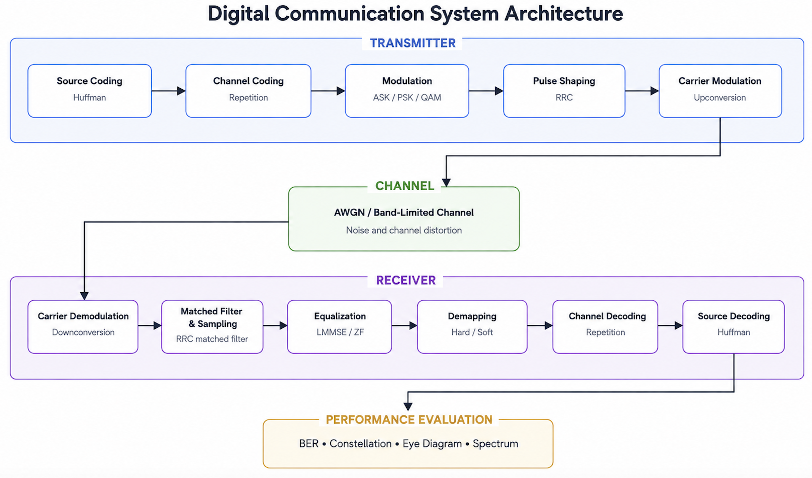
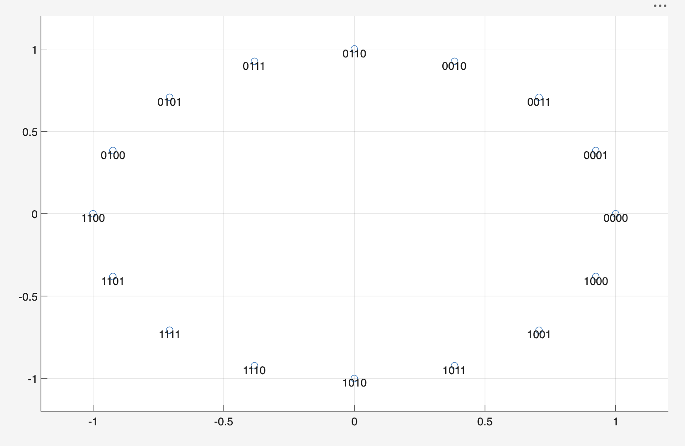
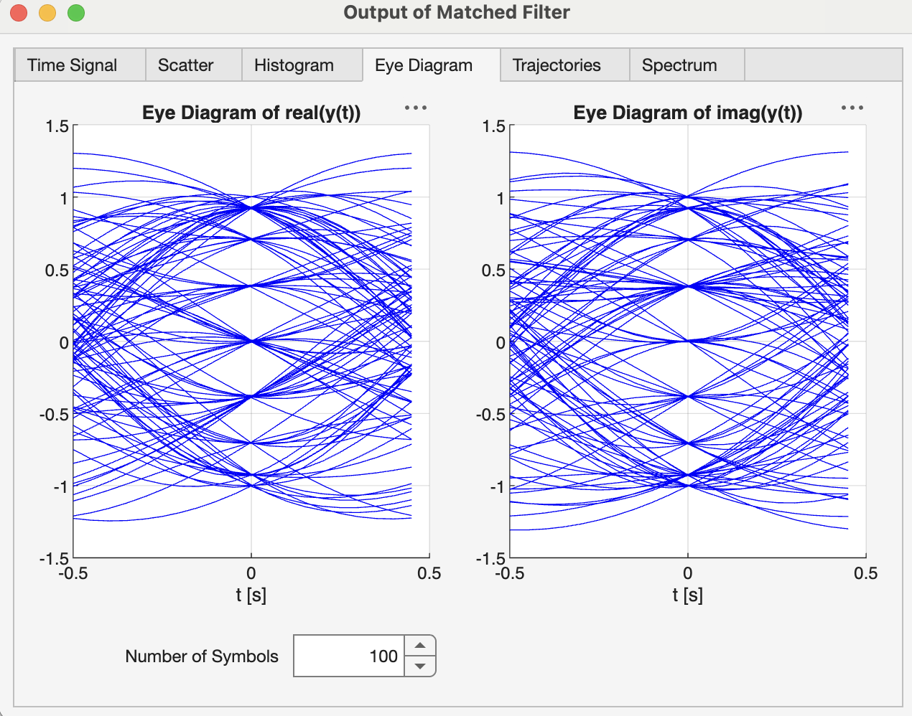
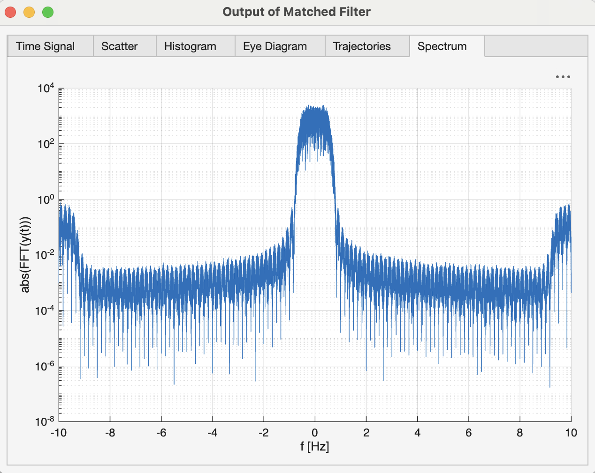
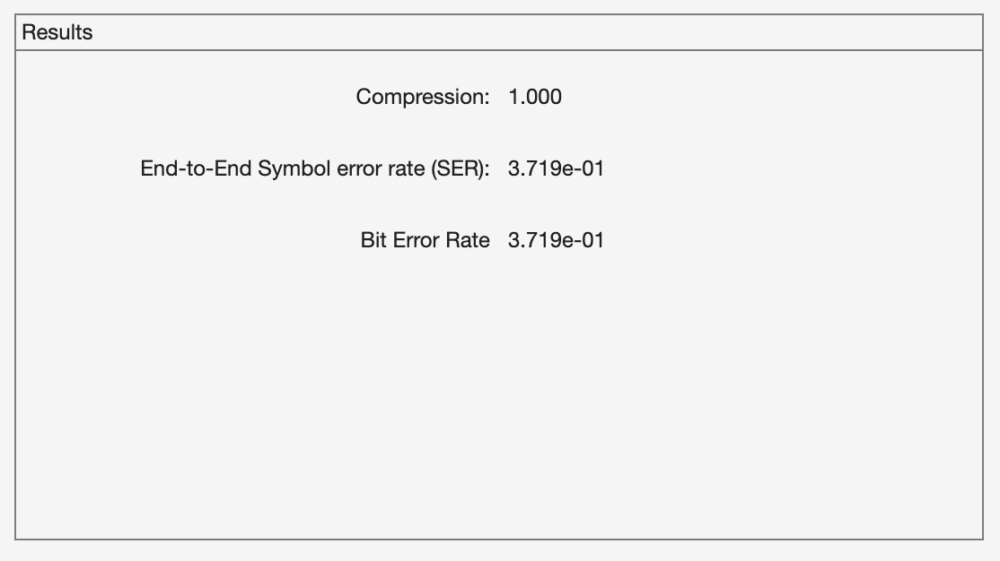
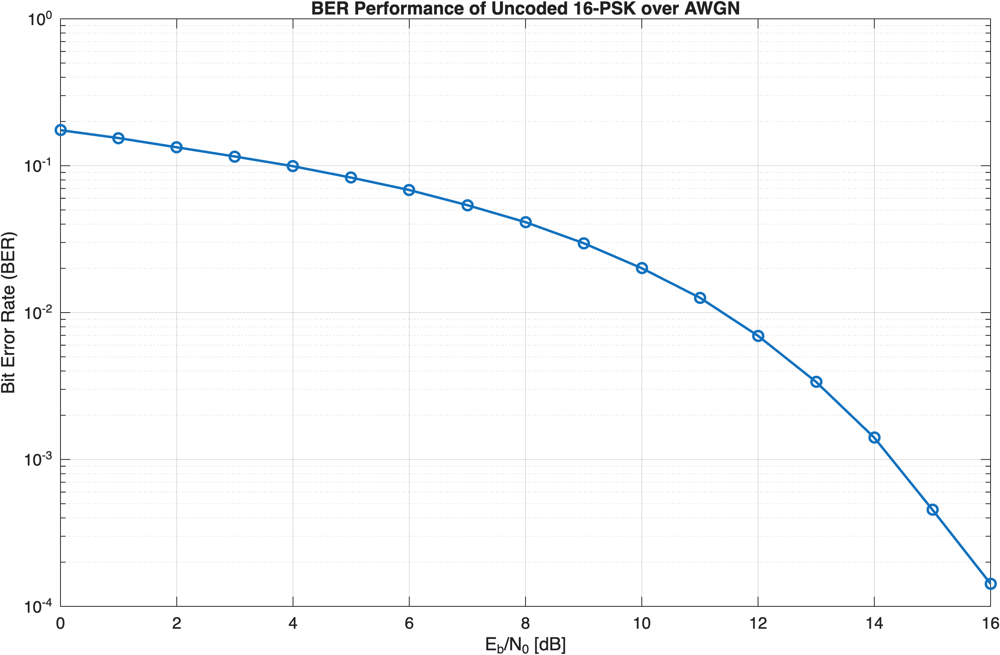

# Digital Communication System Design and Simulation

A modular MATLAB implementation of a complete discrete-time baseband communication system developed to study, implement and evaluate modern digital communication techniques from first principles.

---

## Overview

This project implements a complete end-to-end digital communication chain following the classical discrete-time baseband communication architecture. Rather than relying on MATLAB Communication Toolbox functions, every processing stage was implemented independently to provide a deeper understanding of modern communication systems and their underlying engineering principles.

The implementation covers the complete transmission chain, including source coding, channel coding, digital modulation, pulse shaping, channel modelling, synchronization, equalization, receiver processing and communication performance evaluation.

---

## Engineering Decisions

The primary objective of this project was not only to obtain a working communication system, but to understand the engineering rationale behind each processing stage.

Rather than relying on existing communication toolboxes, each module was implemented independently to investigate its theoretical foundations, practical implementation and contribution to overall system performance. Throughout the project, alternative algorithms and implementation approaches were studied, evaluated and refined based on communication theory and simulation results.

---

## Motivation

Modern communication systems are typically built upon highly optimized software libraries that abstract much of the underlying signal processing. This project was developed to bridge communication theory and practical implementation by constructing each functional block from scratch, evaluating alternative implementation approaches and analyzing their influence on overall system performance.

---

## System Architecture



---

## Implemented Components

### Source Coding
- Huffman Source Coding

### Channel Coding
- Block / Channel Coding

### Digital Modulation
- ASK
- PSK
- QAM

### Signal Processing
- Root Raised Cosine Pulse Shaping
- Synchronization
- Hard & Soft Demapping
- LMMSE Equalization

### Channel Models
- AWGN Channel

### Performance Evaluation
- Bit Error Rate (BER)
- Signal Constellation Analysis
- Eye Diagram Analysis
- Spectral Analysis

---

## Example Results

### Signal Constellation

16-PSK Constellation Diagram
Gray-coded symbol mapping used by the implemented modulation and demapping modules.



### Eye Diagram

Eye Diagram after Matched Filtering
Real and imaginary components of the received signal after pulse shaping and matched filtering.



### Spectrum Analysis

Spectrum after Matched Filtering
Frequency-domain representation of the received signal after pulse shaping and matched filtering.



### BER (Bit Error Rate) Analysis

Bit and symbol error rates obtained for a 16-PSK transmission with matched transmitter and receiver carrier frequencies (5.5 Hz).



### BER Performance

BER performance of the implemented uncoded 16-PSK communication system over an AWGN channel, evaluated for different \(E_b/N_0\) values.




Representative simulation results and figures are provided in the `docs/results/` directory.

---

## Repository Structure

```
digital-communication-system/
│
├── docs/
├── report/
├── src/
│   ├── carrier/
│   ├── channel/
│   ├── channel_coding/
│   ├── demapping/
│   ├── equalization/
│   ├── matched_filter/
│   ├── modulation/
│   ├── pulse_shaping/
│   └── source_coding/
│
└── README.md
```

---

## Future Improvements

- OFDM-based communication systems
- Multipath fading channel models
- Adaptive equalization techniques
- Channel estimation algorithms
- MIMO communication systems
